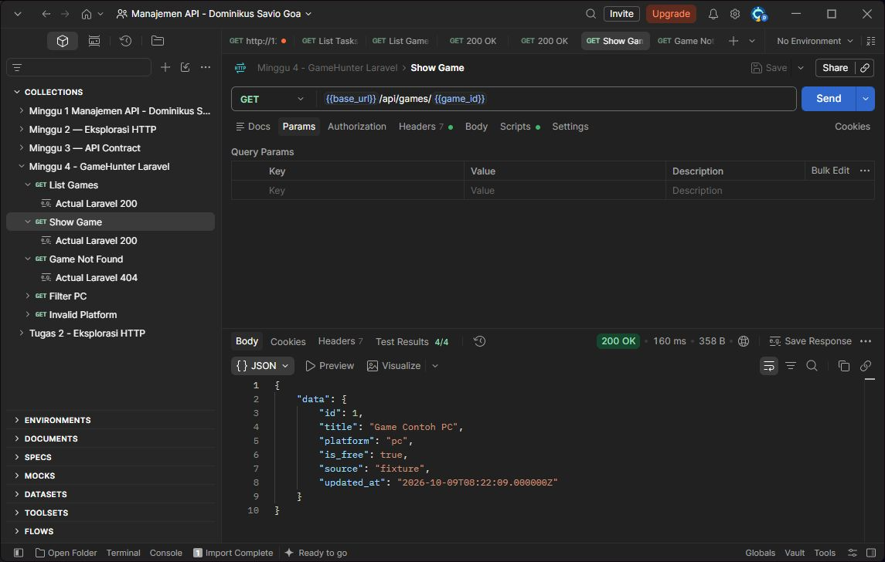

# Praktikum Minggu 4 — GameHunter Laravel

## Tujuan

Membuat endpoint baca untuk resource Game dengan Laravel.

## Perubahan

Saya membuat model Game, migration, GameSeeder, GameController, dan dua route GET. Project memakai Laravel 13, PHP 8.4, dan SQLite. Seeder menyediakan dua game contoh.

## Endpoint dan contract

| Method | Endpoint | Hasil |
| --- | --- | --- |
| GET | /api/games | 200, daftar game |
| GET | /api/games/{game} | 200, detail; 404 jika tidak ada |
| GET | /api/games?platform=pc | 200, game PC |

Gunakan `Accept: application/json` dan No Auth. Response mengikuti [API contract](api-contract.md). Daftar memakai array, detail memakai object, dan `is_free` berupa boolean. Query platform hanya menerima `pc` atau `browser`; query lain menghasilkan 422.

## Bukti pengujian

Pengujian dilakukan pada 9 Oktober 2026. Pest: **13 test, 34 assertion lulus**. Newman: **5 request, 18 assertion lulus**.

Daftar game — 200 OK, 4/4 test Postman lulus.


Detail game — 200 OK, 4/4 test Postman lulus.



ID tidak ditemukan — 404 Not Found, 3/3 test Postman lulus.


## Menjalankan ulang

Dari project Laravel lokal yang sudah terpasang:

```bash
php artisan migrate
php artisan db:seed --class=GameSeeder
php artisan serve --host=127.0.0.1 --port=8000
```

Import [collection Postman](<../../Tugas Minggu 4/docs/postman-collection.md>), lalu jalankan List Games terlebih dahulu.

Untuk test otomatis, gunakan terminal kedua:

```bash
php artisan test --compact tests/Feature/GameReadOnlyTest.php
npx newman run postman/GameHunter_Minggu_4.postman_collection.json
```

## Kesimpulan

Daftar dan detail game sudah bisa dibaca dari database. Response sesuai contract dan pengujian lulus. Data masih berupa contoh lokal.

## Referensi

- Materi dan Praktikum 4 dari kelas.
- [API contract GameHunter](api-contract.md).
- [Laravel Routing](https://laravel.com/framework/docs/13.x/routing), [Eloquent](https://laravel.com/framework/docs/13.x/eloquent), dan [Migrations](https://laravel.com/framework/docs/13.x/migrations).

## Deklarasi penggunaan AI

AI membantu saya dalam praktikum dan langkah pengerjaan saat ada kendala.
