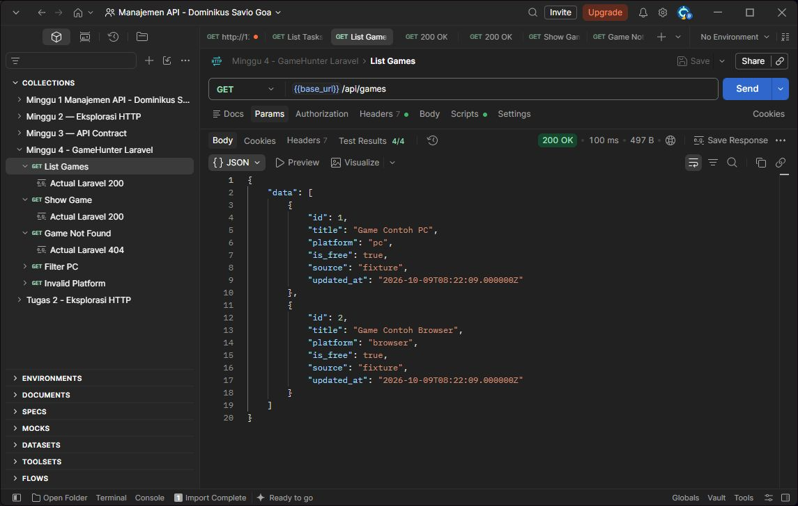
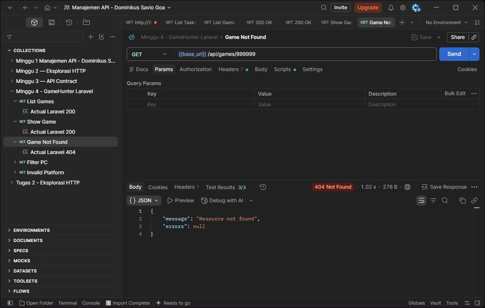

# Tugas Minggu 4 — Endpoint Read-only Laravel

## Tujuan

Membuat endpoint untuk membaca daftar dan detail game sesuai API contract.

## Perubahan

Saya membuat model Game, migration, seeder, controller, dan route GET. Database memakai SQLite dengan dua game contoh. Collection Postman juga diperbarui untuk menguji response.

Saya memilih GET karena tugas ini hanya membaca data. Daftar memakai `data` berupa array, sedangkan detail memakai object. Field dan tipe mengikuti [API contract](<../../Praktikum Minggu 4/docs/api-contract.md>).

## Endpoint dan contract

Gunakan header `Accept: application/json` dan No Auth.

| Method | Endpoint | Hasil |
| --- | --- | --- |
| GET | /api/games | 200, daftar game |
| GET | /api/games/1 | 200, detail game |
| GET | /api/games/999999 | 404, game tidak ditemukan |
| GET | /api/games?platform=pc | 200, game PC |
| GET | /api/games?platform=console | 422, platform tidak valid |

Contoh response sukses:

```json
{
  "data": {
    "id": 1,
    "title": "Game Contoh PC",
    "platform": "pc",
    "is_free": true,
    "source": "fixture",
    "updated_at": "2026-10-09T08:22:09.000000Z"
  }
}
```

## Bukti pengujian

Diuji pada 9 Oktober 2026. Pest: **13 test, 34 assertion lulus**. Newman: **5 request, 18 assertion lulus**.

GET /api/games — 200 OK, 4/4 test Postman lulus.



GET /api/games/1 — 200 OK, 4/4 test Postman lulus.


GET /api/games/999999 — 404 Not Found, 3/3 test Postman lulus.



Untuk mencoba ulang, ikuti [langkah praktikum](<../../Praktikum Minggu 4/docs/minggu-4-praktikum.md>) dan import [collection Postman](postman-collection.md).

## Error case

ID yang tidak ada menghasilkan 404:

```json
{"message":"Resource not found","errors":null}
```

Platform yang tidak valid menghasilkan 422. Daftar kosong tetap 200 dengan `data: []`. POST menghasilkan 405 karena endpoint tulis belum dibuat.

## Kesimpulan

Endpoint baca sudah sesuai contract. Response sukses dan error telah diuji. Data masih berupa contoh lokal. GitHub berisi laporan dan gambar; kode Laravel ada di project lokal `projek_api`.

## Referensi

- Materi 4 dan instruksi Tugas 4.
- [Hasil Praktikum 4](<../../Praktikum Minggu 4/docs/minggu-4-praktikum.md>).
- [API contract](<../../Praktikum Minggu 4/docs/api-contract.md>).
- [Laravel Routing](https://laravel.com/framework/docs/13.x/routing) dan [Eloquent](https://laravel.com/framework/docs/13.x/eloquent).

## Deklarasi penggunaan AI

AI membantu saya dalam praktikum dan langkah pengerjaan saat ada kendala.
